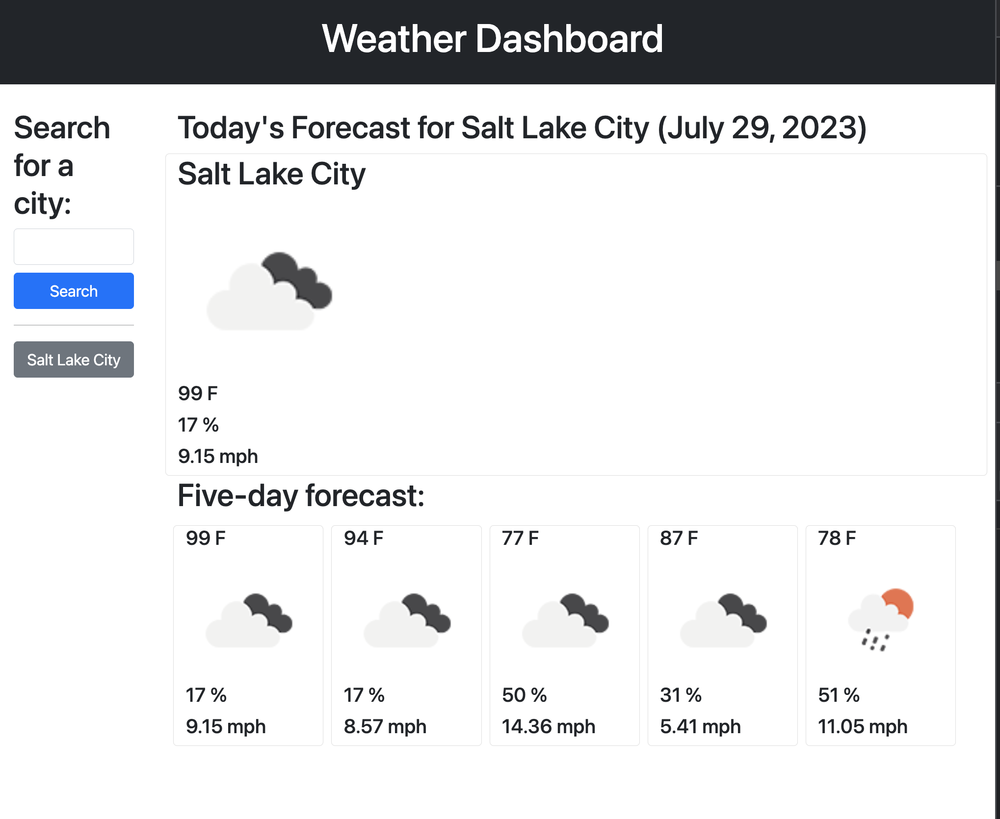
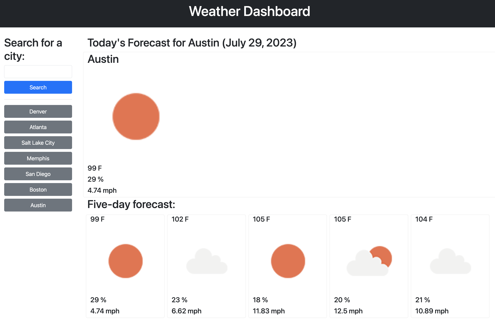

# Weather-App
A simple JavaScript application that fetches weather data from the openweather.org API and displays the current weather for a specified city. Users can input the city name, and the app will show real-time information such as temperature, weather description, humidity, and wind speed.

## Here's what I did: 

<li> Outlined html
<li> Defined OpenWeather api search queries
<li> Since the weather api requires lat/long coordinates, and I want users to be able to search by city name, I wrote a function to retrieve the lat/long coordinates of a given city from OpenWeather's coordinate finder api
<li> Created function to enter those coords into a forecast query and extract from the response the forecast elements I want to display to users
<li> Wrote logic to retrieve daily forecast(rather than every 3 hours)from hourly forecast array using a method I learned on <a href='https://stackoverflow.com/a/33483070'>Stack Overflow</a>. Thanks <a href='https://stackoverflow.com/users/586181/nicholas'>@nicholas!</a>
<li> Added cities to local storage as needed and added event listeners so the buttons would be interactive
<li> Added logic to clear data when a new search term is entered
<li> Added logic to display last city searched on reload (if it exists in local storage).

## Screenshots

## Github Repo

https://github.com/Cheloe/Weather-App

## Deployed
https://github.io/Cheloe/Weather-App